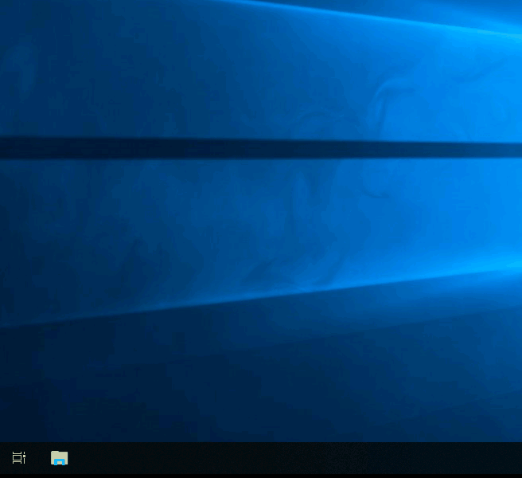

# HỆ THỐNG TẬP TIN TRÊN WINDOWS: TỔNG QUAN VỀ NTFS

Trong các phiên bản Windows hiện đại, **NTFS (New Technology File System)** là hệ thống tập tin tiêu chuẩn và đóng vai trò xương sống cho việc quản lý dữ liệu. 

Trước khi NTFS trở nên phổ biến, các hệ điều hành sử dụng hệ thống cũ như **FAT16, FAT32 (File Allocation Table)** hoặc **HPFS (High Performance File System)**. Hiện tại, định dạng FAT vẫn còn tồn tại trên các thiết bị lưu trữ ngoài (như USB, thẻ nhớ MicroSD) vì tính tương thích đa nền tảng. Tuy nhiên, đối với hệ thống lưu trữ cốt lõi của Windows (ổ `C:\`) hay các máy chủ doanh nghiệp, NTFS là giao thức bắt buộc nhằm khắc phục các điểm yếu chí mạng của FAT (giới hạn tệp 4GB và lỗ hổng bảo mật).

---

## 1. Cơ Chế "Ghi Nhật Ký" (Journaling)
Điểm khác biệt cốt lõi giúp NTFS bền vững hơn các định dạng tiền nhiệm là cơ chế **Journaling (Ghi nhật ký hệ thống)**.

Bất cứ khi nào có lệnh thay đổi về dữ liệu (sao chép, xóa, di chuyển file), hệ thống NTFS sẽ ghi lại tiến trình này vào một tệp nhật ký (log file) trước khi thực sự thi hành lệnh. Nếu nguồn điện bị ngắt đột ngột hoặc hệ thống gặp sự cố (crash), tiến trình tự động khôi phục sẽ được kích hoạt dựa trên nhật ký này. Hệ thống sẽ tự động dọn dẹp các tệp bị lỗi và bảo vệ toàn vẹn cấu trúc ổ đĩa. Khả năng tự phục hồi này hoàn toàn không tồn tại trên kiến trúc FAT.

---

## 2. Ưu Điểm Vượt Trội Của NTFS
Bên cạnh cơ chế Journaling, NTFS được thiết kế cho các môi trường đòi hỏi sự ổn định và bảo mật cấp bách. Các tính năng nổi bật bao gồm:

*   **Vượt giới hạn dung lượng:** Hỗ trợ lưu trữ các tệp tin khổng lồ (vượt xa mức giới hạn 4GB của FAT32), đáp ứng yêu cầu lưu trữ cơ sở dữ liệu lớn hoặc tệp máy ảo.
*   **Phân quyền chi tiết (Permissions):** Cho phép thiết lập quyền truy cập cho từng tệp hoặc thư mục cụ thể đối với từng User/Group trên hệ thống.
*   **Nén dữ liệu (Compression):** Nén tệp ở cấp độ lõi hệ thống để tối ưu hóa không gian lưu trữ mà không làm gián đoạn quá trình truy xuất dữ liệu.
*   **Mã hóa cấp độ tệp (Encryption):** Tích hợp sẵn nền tảng EFS (Encrypting File System), tự động mã hóa các dữ liệu nhạy cảm. Dữ liệu sẽ hoàn toàn vô dụng nếu ổ cứng bị tháo rời và gắn sang một hệ thống khác mà không có khóa giải mã hợp lệ.

> **Giao thức kiểm tra:** Để xác định phân vùng hiện tại có sử dụng NTFS không, Agent thao tác click chuột phải vào ổ đĩa hệ điều hành (thường là ổ `C:\`), chọn **Properties**.

`[ 🖼️ CHÈN ẢNH VÀO ĐÂY: Cửa sổ Properties của ổ C:\, khoanh đỏ hoặc bôi đậm dòng chữ "File system: NTFS" ]`

---

## 3. Quyền Hạn Kiểm Soát (NTFS Permissions)
Bảo mật trên phân vùng NTFS được thực thi thông qua Danh sách Kiểm soát Truy cập (ACL). Giao thức này chỉ định chính xác thực thể nào được phép tương tác với dữ liệu. 

Sáu cấp độ quyền hạn cơ bản bao gồm:
1.  **Full control (Toàn quyền):** Cấp quyền đọc, ghi, sửa, xóa file, và cấp phép thay đổi cả quyền sở hữu (Ownership).
2.  **Modify (Sửa đổi):** Cấp quyền đọc, ghi và xóa tệp, nhưng không được phép can thiệp vào quyền bảo mật của tệp đó.
3.  **Read & Execute (Đọc & Thực thi):** Được phép mở file để đọc dữ liệu và kích hoạt các file thực thi (`.exe`, script).
4.  **List folder contents (Liệt kê nội dung):** Áp dụng riêng cho cấu trúc thư mục. Trả về danh sách các tệp/thư mục con bên trong (nhưng không bao hàm quyền mở các tệp đó).
5.  **Read (Đọc):** Chỉ cho phép trích xuất nội dung (xem, sao chép), vô hiệu hóa toàn bộ các lệnh chỉnh sửa hoặc lưu đè.
6.  **Write (Ghi):** Cho phép khởi tạo tệp mới hoặc ghi thêm dữ liệu vào tệp hiện hữu.

### Quy trình kiểm tra phân quyền NTFS:
*   Click chuột phải vào mục tiêu (tệp/thư mục), chọn **Properties**.
*   Chuyển hướng sang tab **Security**.
*   Tại mục *Group or user names*, chọn một thực thể (ví dụ: Administrators, Users). Thông số phân quyền (Allow/Deny) sẽ được hiển thị chi tiết tại khung bên dưới.

??? note "Mở rộng để xem ảnh minh họa"

    
---

## 4. Kỹ Thuật Tàng Hình: Alternate Data Streams (ADS)
**Alternate Data Streams (ADS)** là một đặc tính kiến trúc cốt lõi, chỉ tồn tại trên hệ thống tập tin NTFS. Kiến trúc này khởi thủy được Microsoft thiết kế nhằm duy trì khả năng tương thích với hệ thống tệp HFS của máy Mac. Tuy nhiên, trong không gian an toàn thông tin, ADS đã trở thành một "vùng tối" lý tưởng để cất giấu payload.

**Khái niệm cốt lõi:**
Một tệp tin NTFS không đơn thuần là một khối dữ liệu duy nhất. Nó là một tập hợp của nhiều "luồng" (streams). 
*   Luồng mặc định chứa nội dung hiển thị được định danh là `$DATA` (Luồng vô danh). 
*   Hệ thống NTFS cho phép ghim thêm vô số các luồng phụ (ADS) vào phía sau luồng mặc định này. Kích thước (size) của tệp hiển thị trên giao diện Windows Explorer sẽ **không thay đổi**, qua mặt hoàn toàn các phương thức kiểm tra bằng mắt thường.

### Thực Thi Bằng Lệnh (Command Line Execution)
Dưới đây là các giao thức dòng lệnh (CMD/PowerShell) cơ bản để Agent thao tác trực tiếp với ADS.

#### Bước 1: Khởi tạo luồng dữ liệu ẩn (Creation)
Sử dụng Command Prompt (`cmd.exe`). Bắt đầu bằng việc tạo một tệp tin vỏ bọc vô hại.
```cmd
echo "Day la file van ban binh thuong" > cover.txt
```
Tiếp theo, tiêm một chuỗi dữ liệu bí mật vào luồng ADS (đặt tên luồng là `hidden.txt`). Chú ý cú pháp dấu hai chấm (`:`).
```cmd
echo "Day la du lieu tuyet mat bi giau" > cover.txt:hidden.txt
```
Lúc này, nếu Agent kiểm tra dung lượng của `cover.txt`, kích thước tệp vẫn chỉ tính bằng độ dài của chuỗi văn bản vỏ bọc. Luồng `hidden.txt` đã hoàn toàn tàng hình.

#### Bước 2: Trích xuất và đọc dữ liệu ẩn (Extraction)
Không thể kích hoạt luồng ADS bằng cách click đúp hay dùng lệnh `type` thông thường. Phải sử dụng lệnh `more` để ép hệ thống xuất luồng phụ.
```cmd
more < cover.txt:hidden.txt
```
Hoặc gọi Notepad để mở trực tiếp luồng ẩn (Chỉ khả dụng trên một số phiên bản Windows cụ thể hoặc dưới quyền Administrator):
```cmd
notepad cover.txt:hidden.txt
```

#### Bước 3: Ẩn tệp thực thi / Payload (Execution Hiding)
Không chỉ văn bản, các tệp nhị phân (`.exe`) hoặc mã độc hoàn toàn có thể bị ép vào ADS.
```cmd
type payload.exe > cover.txt:malware.exe
```
Việc kích hoạt trực tiếp mã độc từ ADS đã bị Microsoft dập tắt trên các phiên bản Windows mới thông qua Command Prompt. Tuy nhiên, lỗ hổng lách luật vẫn tồn tại bằng cách gọi `wmic` (Windows Management Instrumentation Command-line):
```cmd
wmic process call create "C:\path\to\cover.txt:malware.exe"
```

### Phương Thức Quét Và Phát Hiện (Detection Protocol)
Vì giao diện Windows Explorer bị vô hiệu hóa tầm nhìn trước ADS, Agent khi thực hiện công tác SOC (Phân tích bảo mật) phải sử dụng các công cụ sau để săn lùng dữ liệu ẩn:

*   **Qua Command Prompt:** Thêm cờ `/R` vào lệnh `dir` để liệt kê toàn bộ luồng ADS trong thư mục hiện tại.
    ```cmd
    dir /R
    ```
*   **Qua PowerShell:** Cung cấp khả năng kiểm soát mạnh mẽ hơn với cmdlet `Get-Item`.
    ```powershell
    Get-Item -Path "cover.txt" -Stream *
    ```
*   **Công cụ chuyên dụng (Third-Party):** `Streams` (một tiện ích thuộc bộ Sysinternals do chính Microsoft cung cấp) là công cụ tiêu chuẩn ngành để rà quét và dọn dẹp hàng loạt luồng ADS trong toàn hệ thống.